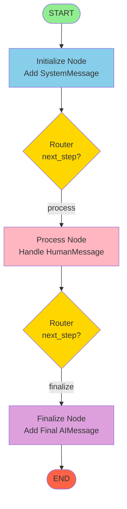

# LangGraph Visualization Guide

## Graph Structure

```
    START
      |
      v
  [initialize]
      |
      | (router checks next_step)
      v
   [process]
      |
      | (router checks next_step)
      v
   [finalize]
      |
      v
     END
```

## Mermaid Diagram

Copy and paste this into [mermaid.live](https://mermaid.live) to see the interactive diagram:



## Node Details

### 1. Initialize Node
- **Input**: Initial state with HumanMessage
- **Action**: Prepends SystemMessage to messages
- **Output**: Sets `next_step = "process"`

### 2. Process Node
- **Input**: State with SystemMessage and HumanMessage
- **Action**: Finds HumanMessage, creates AIMessage response
- **Output**: Sets `next_step = "finalize"`

### 3. Finalize Node
- **Input**: State with all previous messages
- **Action**: Adds final completion AIMessage
- **Output**: Routes to END

## Message Flow

```
┌─────────────────────────────────────────────┐
│ INPUT STATE                                 │
│ messages: [HumanMessage("Hello!")]          │
└─────────────────────────────────────────────┘
                    ↓
┌─────────────────────────────────────────────┐
│ AFTER INITIALIZE NODE                       │
│ messages: [                                 │
│   SystemMessage("You are a helpful..."),    │
│   HumanMessage("Hello!")                    │
│ ]                                           │
│ next_step: "process"                        │
└─────────────────────────────────────────────┘
                    ↓
┌─────────────────────────────────────────────┐
│ AFTER PROCESS NODE                          │
│ messages: [                                 │
│   SystemMessage("You are a helpful..."),    │
│   HumanMessage("Hello!"),                   │
│   AIMessage("I received your message...")   │
│ ]                                           │
│ next_step: "finalize"                       │
└─────────────────────────────────────────────┘
                    ↓
┌─────────────────────────────────────────────┐
│ AFTER FINALIZE NODE                         │
│ messages: [                                 │
│   SystemMessage("You are a helpful..."),    │
│   HumanMessage("Hello!"),                   │
│   AIMessage("I received your message..."),  │
│   AIMessage("Task completed!")              │
│ ]                                           │
└─────────────────────────────────────────────┘
                    ↓
                   END
```

## Conditional Edges

The graph uses **conditional edges** with the `router` function:

```python
def router(state: GraphState) -> str:
    return state.get("next_step", "END")
```

This allows dynamic routing based on the state:
- After `initialize`: routes to `process`
- After `process`: routes to `finalize`
- After `finalize`: routes to `END`

## Key Concepts

1. **SystemMessage**: Sets the context/role for the AI
2. **HumanMessage**: Represents user input
3. **AIMessage**: Represents AI responses
4. **State**: Shared state flows through all nodes
5. **Routing**: Conditional edges connect nodes dynamically
6. **add_messages**: Annotation that automatically manages message lists
